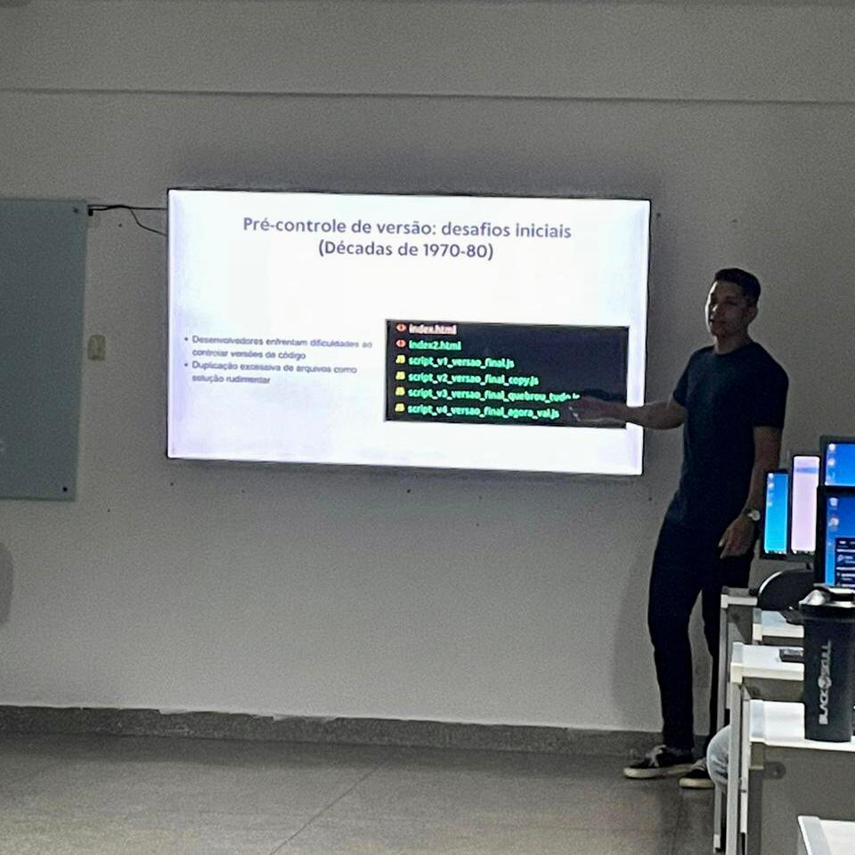

# App Bio dos participantes da Oficina de Versionamento de Código com Git e Github

Este repositório é uma aplicação simples desenvolvida para a palestra de versionamento de código com Git e Github, ministrada durante o evento "Oficinas de Informática e TI" da Universidade Federal de Rondonópolis. Na palestra, os participantes aprenderam e praticaram os conceitos essenciais do Git e Github através desta aplicação.

## Tecnologias Utilizadas

- HTML
- CSS com Bootstrap
- JavaScript
- PHP

## Funcionalidades

- Os participantes podem fazer fork deste projeto.
- Eles podem adicionar um arquivo TXT com suas biografias.
- Os participantes podem abrir um Pull Request para o repositório principal.
- Suas contribuições são exibidas na página do GitHub Pages.

## Como Contribuir

1. Faça um fork deste repositório.
2. Adicione sua biografia em um arquivo TXT no diretório 'bios'.
3. Abra um Pull Request para revisão.
4. Depois de revisado, seu Pull Request será mesclado e sua contribuição será exibida na página do GitHub Pages.

## Como Visualizar as Contribuições

Você pode ver as contribuições dos participantes na [página do GitHub Pages](https://felipeverse.github.io/app-bio-participantes-oficina/).

## Licença

Este projeto está licenciado sob a licença [MIT](https://opensource.org/licenses/MIT).
